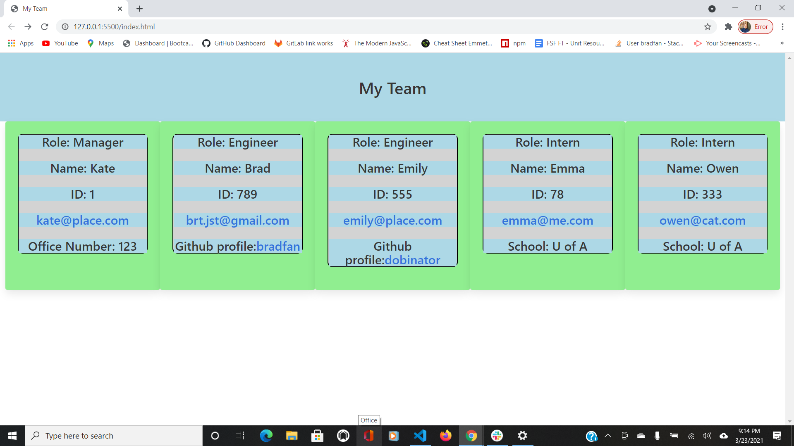

# Team-Profile-Generator

Github Link: https://github.com/bradfan/Team-Profile-Generator

Video Link:

When the user is given a command-line application that accepts user input, they are prompted for their team members and their information and an HTML file is generated that displays a nicely formatted team roster based on user input. When the user clicks on an email address in the HTML the user's default email program opens and populates the TO field of the email with the address. When they click on the GitHub username, that GitHub profile opens in a new tab.When the user starts the application, they are prompted to enter the team manager’s name, employee ID, email address, and office number. When they enter the team manager’s name, employee ID, email address, and office number, they are presented with a menu with the option to add an engineer or an intern or to finish building their team. When they select the engineer option, they are prompted to enter the engineer’s name, ID, email, and GitHub username, and they are taken back to the menu. When they select the intern option, they are prompted to enter the intern’s name, ID, email, and school, and they are taken back to the menu. When they decide to finish building their team, they exit the application, and the HTML is generated.

